# Exercise 1: Connect To Your Source MySQL Database

In this exercise, you will be connecting your source **MySQL Database** hosted on the EC2 Windows Instance (LabVM) using the **MySQL Workbench Application**.

Follow the below steps to connect to your **MySQL Database** using the **MySQL Workbench Application:**

1. Open the **MySQL Workbench Application** on the LabVM, and on the MySQL Workbench homepage, click on the plus icon to add a new database connection.

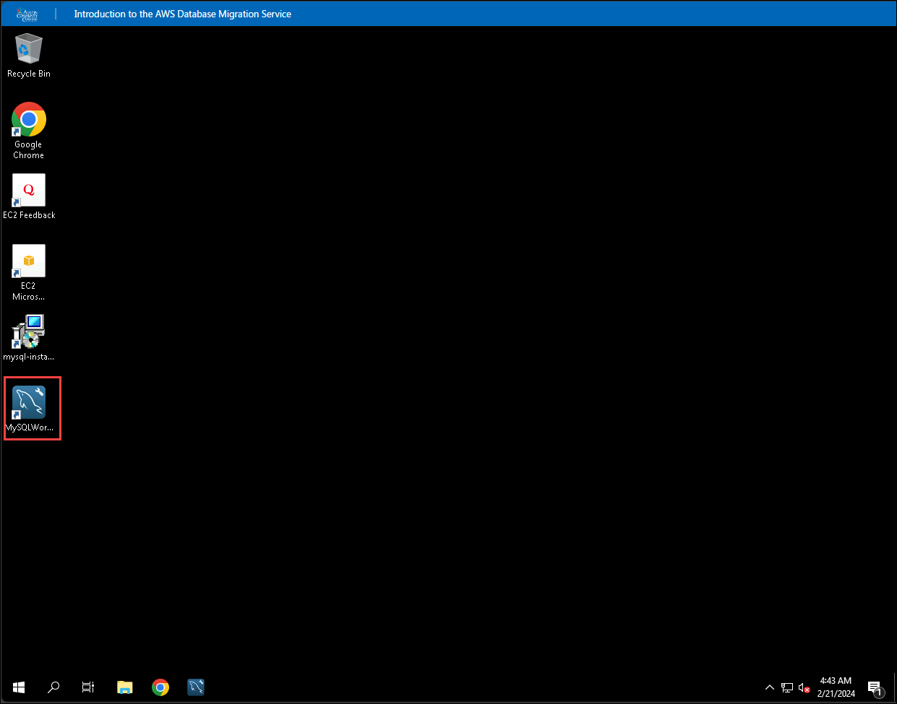

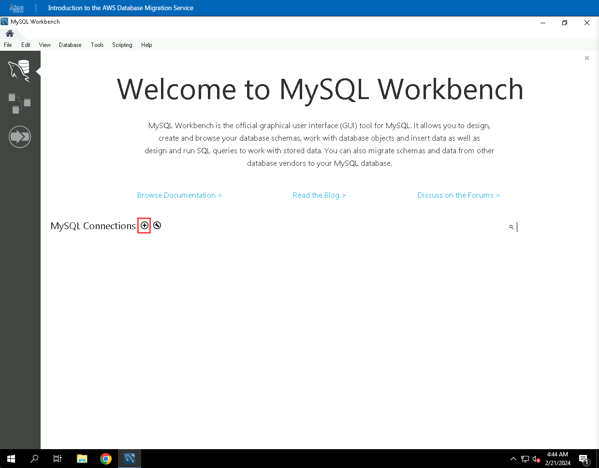

2. Provide the below details in the opened **Setup New Connection** dialog box:

* For the Connection Name, enter **Source.**

* For the Username, enter

* For the Password click on **Store in Vault**, and enter , and then click **OK**.

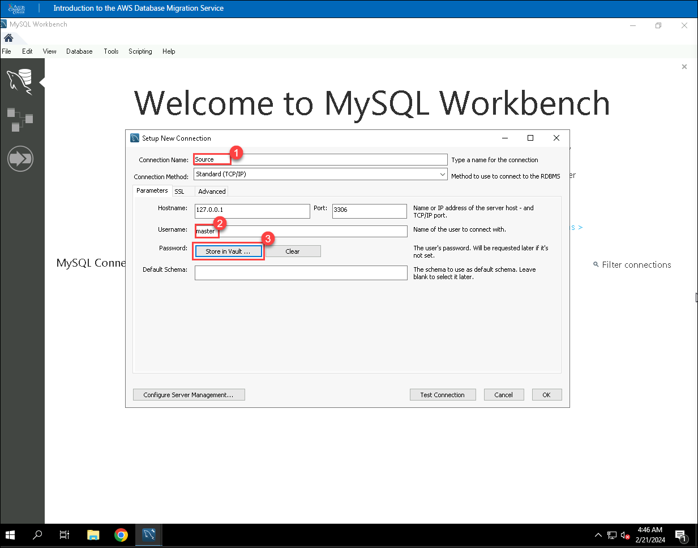

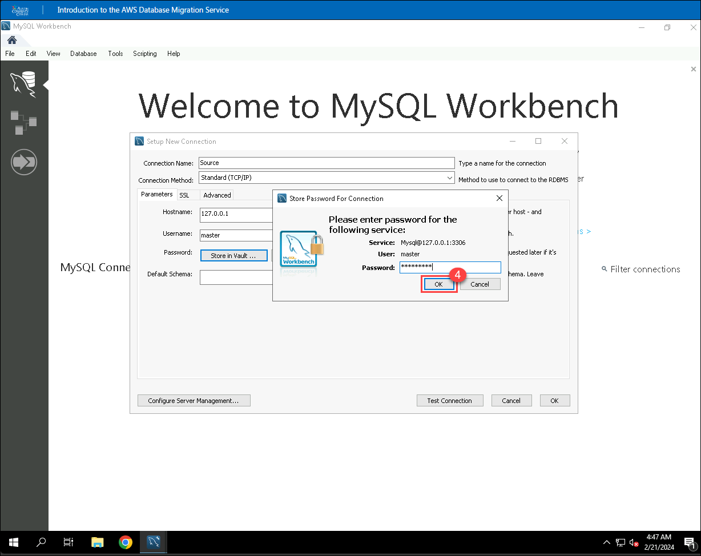

3. Click on **Test Connection** to verify whether the connection with MySQL is successful and then click **OK**.

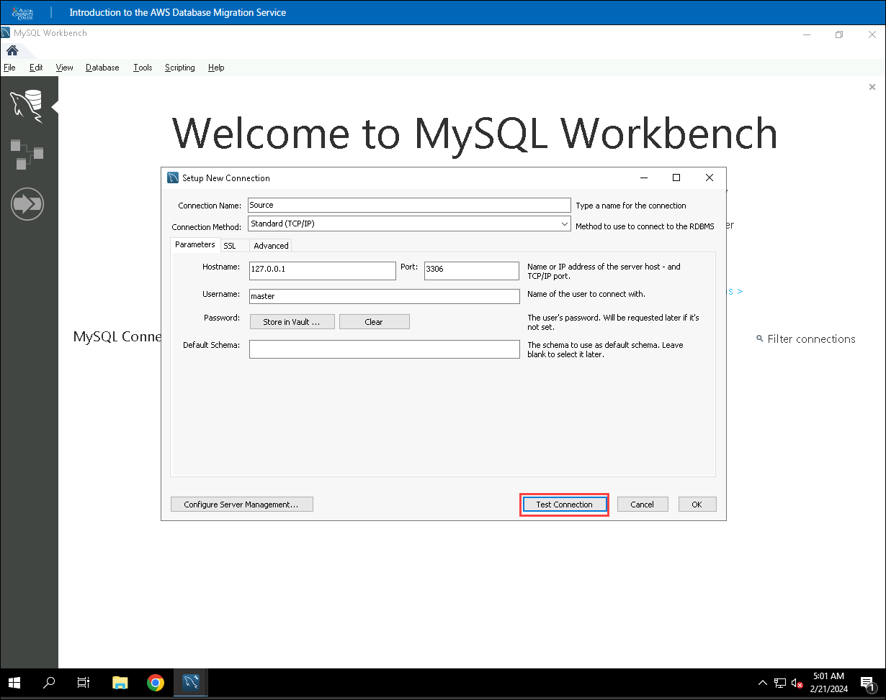

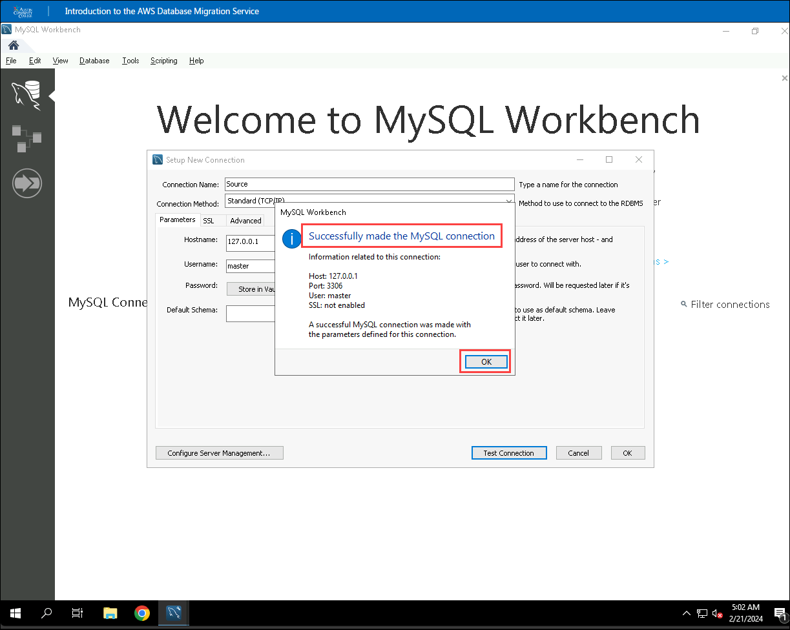

4. Click on **OK** to save the connection details and verify that the connection is added with the name **Source**.

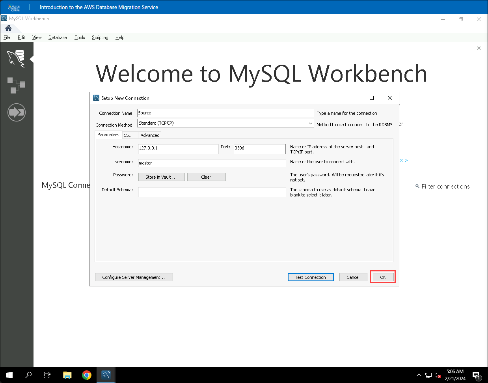

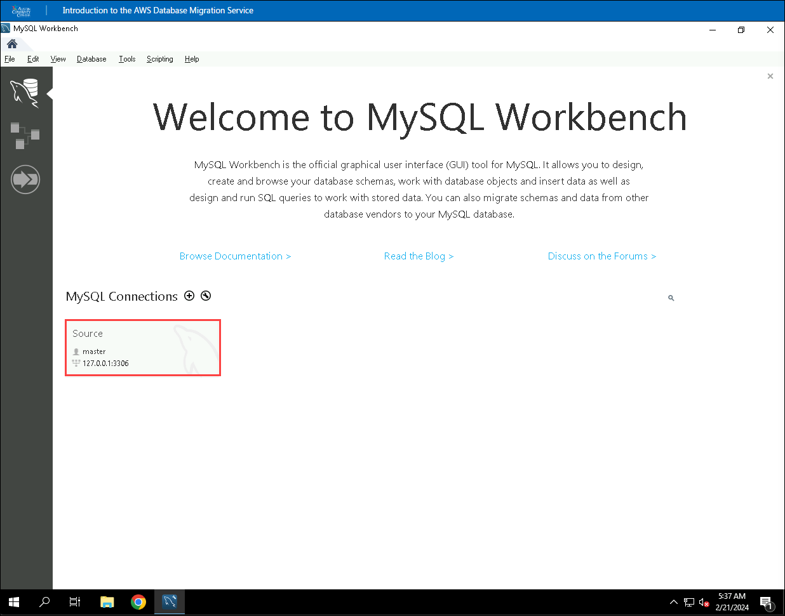

5. Double click on connection **Source** to open a **Query Editor**.

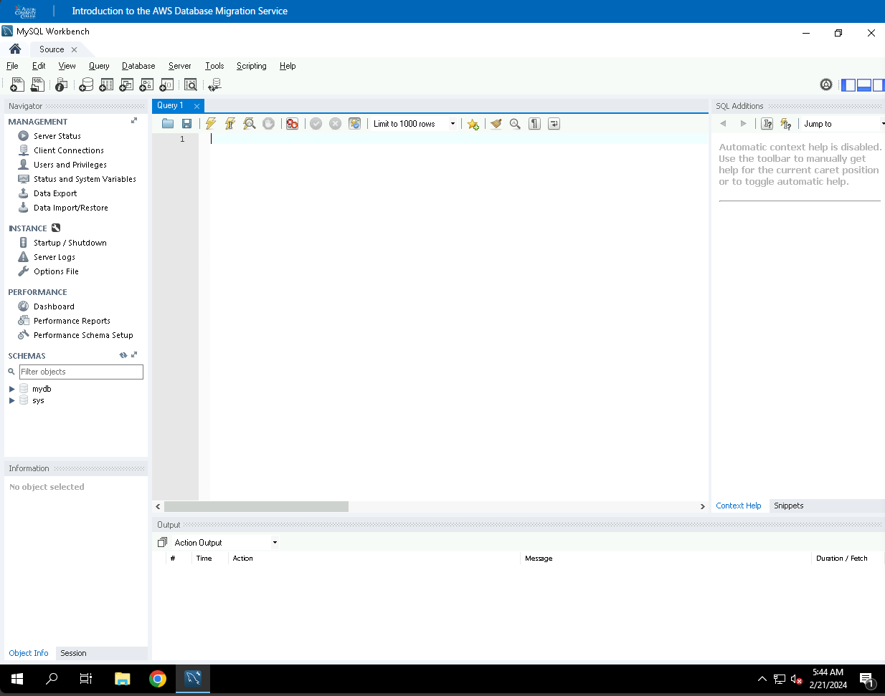

6. Go to the workbench and find the navigation pane on the left. Look for "schemas" and click on it. You'll see a database named "mydb." Under it, you'll find "Tables."

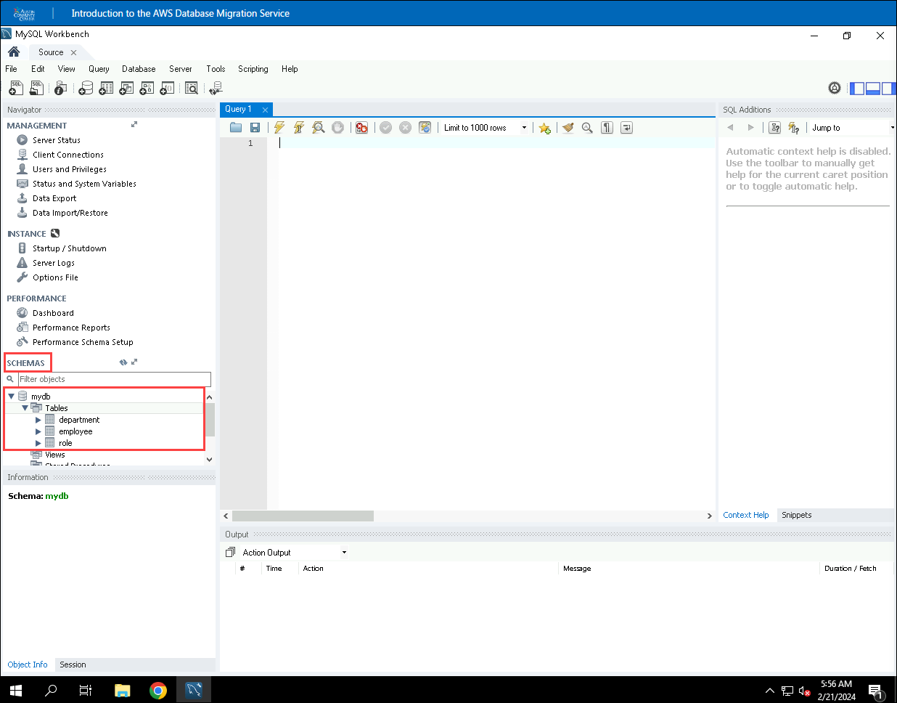

7. To load the data stored in the employee table, copy and paste the command given below, and then click on the execute button to run the query.

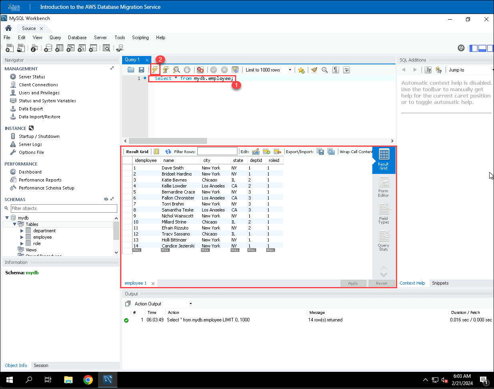