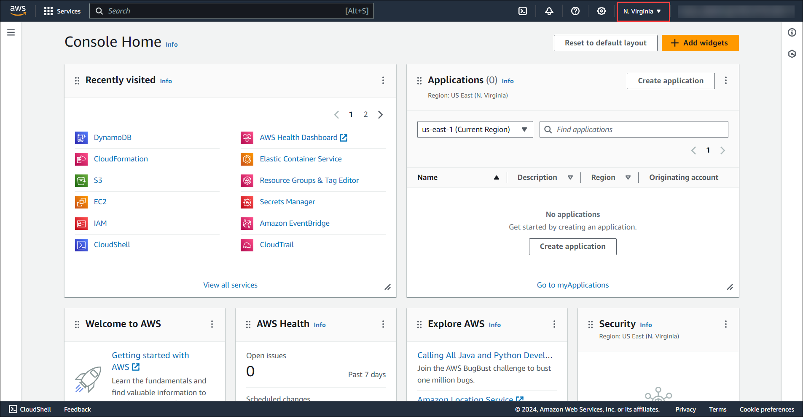

# Introduction to AWS Database Migration Service

This lab offers a fundamental exploration of the AWS Database Migration Service. Through this exercise, you will gain hands-on experience migrating data from a MySQL database hosted on an Amazon EC2 instance to an Amazon Aurora RDS instance.

## Pre-Created Resources

* Windows EC2 Instance (LabVM) with tools like MySQL Workbench.
* Amazo Aurora RDS Instance.

## Key Learnings

* Connect To Your Source MySQL Database.
* Connect to a pre-created Amazon Aurora instance.
* Migrate data from your MySQL server to your 
Aurora instance.
* Verify that your migration was successful.

## Duration

* This lab approximately requires 90 minutes to complete.

# Getting Started With AWS Database Migration Service

Follow the steps below to get started with the lab.

1. Open Google Chrome in Windows EC2 Instance (LabVM) and sign in to the AWS Management Console by copying the Sign-in link, Username, and Password provided below.

* **Sign-in Link:**

* **IAM Username:**

* **Password:**

Alternatively, you can also find these values on the CloudLabs Environment tab.

2. After signing in to the AWS Management Console, choose the region **US-EAST-1 (N. Virginia)** from the drop-down menu.

**Note:** You can deploy the resources in any of the six regions mentioned below:

* **us-east-1 (N. Virginia)**

* **us-east-2 (Ohio)**

* **us-west-2 (Oregon)**

* **eu-central-1 (Frankfurt)**

* **eu-west-2 (London)**

* **ap-southeast-1 (Singapore)**

